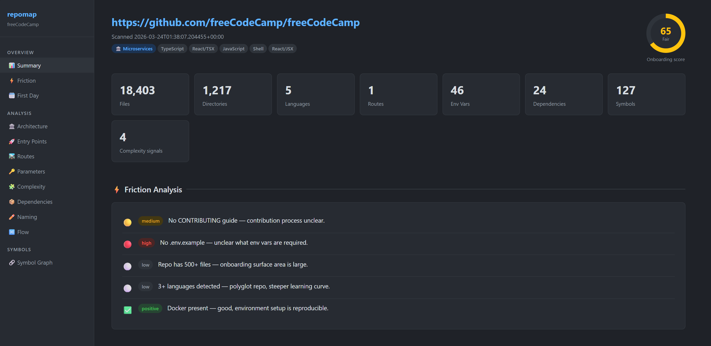
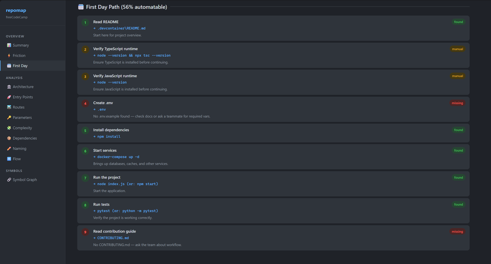

# repomap 🗺️

**Paste a repo URL. Understand the codebase in minutes.**

repomap is a command-line tool that clones any GitHub repository, analyzes its structure, and produces a set of living reference documents — a friction report, a dependency map, a route inventory, a cross-file symbol graph, and an interactive browser dashboard — all from a single command.

---

## Why this exists

Documentation lies. Not intentionally...but it drifts. It gets written once, forgotten, and slowly becomes fiction.Meanwhile, the real structure of a codebase lives in:

- scattered files
- implicit conventions
- tribal knowledge
- “just ask John”

That leads to real problems:

- New devs spend days figuring out how to even run the app
- Teams inherit repos they didn’t build and have no map for
- Engineers hesitate to make changes because they don’t know the blast radius
- Leads can’t easily see how architecture has evolved (or degraded)

repomap fixes that by reading the code directly and generating a current, objective snapshot of the system.

No docs required. No setup from the team.

Just:
```bash
python repomap.py <repo-url> 
```

repomap generates that map automatically, directly from the code that's actually running. It doesn't ask anyone to write anything. You point it at a repo URL and it does the rest.


### 👀 What this looks like



---

## What you get

Running repomap against a repo generates several outputs depending on which flags you use:

### Always produced
| Output | What it is |
|--------|-----------|
| Terminal summary | Colour-coded scan results printed to your console |
| `repomap_<slug>.json` | Full machine-readable report — every finding, score, and analysis result |
| `repomap_<slug>.md` | Human-readable Markdown — paste into Notion, Confluence, or a pull request |

### With `--symbols`
| Output | What it is |
|--------|-----------|
| `repomap_<slug>_symbols.json` | Cross-file symbol graph — every function, class, and variable that crosses file boundaries, with its definition location, every file that imports it, and specific call sites |
| `repomap_<slug>_symbols.md` | Readable reference doc organized by file — the public API surface of each module |

### With `--serve`
An interactive browser dashboard opens automatically with 12 navigable sections, a searchable route table, a searchable dependency table, and a live force-directed symbol graph you can drag, zoom, and explore. Check out the symbol graph I had a really great time checking different repos with it.

---

## What it analyzes

### Base scan (always runs)
- **Entry points** — `main.py`, `app.py`, `Dockerfile`, `Makefile`, `Procfile`, and equivalents across all major languages
- **Routes** — HTTP routes extracted with method, path, file, and framework
- **Config files** — `.env`, `pyproject.toml`, `package.json`, `settings.*`, and more
- **Models / schemas** — ORM classes, dataclasses, migration files
- **Tests** — test directories and test files across Python, JS, and TypeScript
- **Docs** — README, CONTRIBUTING, CHANGELOG, docs directories
- **CI/CD** — GitHub Actions, CircleCI, Travis, Jenkins, and others
- **Languages** — detected by file extension with file counts
- **Onboarding score** — 0–100 score with severity-graded friction issues



### Deep analysis (9 passes, runs by default)

| Pass | What it tells you |
|------|------------------|
| **Architecture classification** | What pattern the codebase follows — monolith, microservices, clean DDD, event-driven, full-stack SPA, serverless, etc. Scored with confidence level and evidence |
| **Entry point confidence** | Each entry point scored 0–100 with the signals behind the score — helps identify the *real* starting point vs noise |
| **First day path** | An ordered, status-tagged checklist of exactly what a new developer needs to do: read README → copy env → install deps → start services → run migrations → run the app → run tests. Each step shows the actual command and whether it was found automatically |
| **Naming consistency** | Scans file names, directory names, Python functions, and classes for style clashes (snake_case vs camelCase, etc.) — surfaces inconsistencies that hint at organic growth or multiple contributors |
| **Route detection** | Deep extraction: method, path, handler file, and framework. Handles FastAPI decorators, Express app.get(), Django path(), Go/Gin, and Next.js file-based routing |
| **Parameter tracking** | Inventories every environment variable, config key, and CLI flag referenced in source code. Cross-references against `.env.example` and flags anything used in code but not documented |
| **Dependency impact** | Parses dependency manifests and cross-references each package against source files to show how deeply each dependency is woven in — high/medium/low impact, which directories it touches, and possibly unused packages |
| **Hidden complexity** | Scans for 11 signals: dynamic dispatch (`getattr`/`eval`), monkey patching, global mutable state, threading/asyncio, deep nesting (5+ indent levels), god files (500+ lines), magic numbers, TODO/FIXME debt, `subprocess(shell=True)`, possible hardcoded credentials, and bare `except:` clauses |
| **Flow trace** | Traces import/require chains from entry points up to 3 levels deep, builds a dependency graph, and surfaces the most-imported modules — the files you need to understand first |

### Symbol graph (`--symbols`)
Two-pass AST analysis across every source file. Pass 1 extracts all public function, class, variable, constant, and type definitions. Pass 2 finds every file that imports them. The result is a complete map of your codebase's internal API surface: what each file exports, who consumes it, and where.

---

## Installation

*Using a virtual environment is recommended*

```bash
# 1. Clone or download the repomap files
# 2. Install the one required dependency
pip install click

# 3. Confirm git is available
git --version
```

**Requirements:**
- Python 3.10 or higher
- `git` on your PATH
- `click` (`pip install click`)
- An API key for at least one LLM provider if you want to use the --llm commands for better analysis. Not required. 

No other external dependencies. Everything else uses Python's standard library.

---

## Usage

### The simplest command
```bash
python repomap.py https://github.com/org/repo
```

Scans the repo, runs all 9 analysis passes, prints a terminal summary, and writes a JSON and Markdown report to the current directory.

### Open the interactive dashboard
```bash
python repomap.py https://github.com/org/repo --serve
```

Does everything above, then starts a local server and opens the dashboard in your browser.

### Full output — dashboard + symbol graph + AI summary
```bash
python repomap.py https://github.com/org/repo --serve --symbols --llm
```

The most complete picture. Adds the cross-file symbol map and an AI-written plain-English summary of the entry points and how to run the project.

### Save reports to a folder
```bash
python repomap.py https://github.com/org/repo -o ./reports
```

### Serve a report you already generated
```bash
python report_server.py reports/repomap_<slug>.json
python report_server.py reports/repomap_<slug>.json --symbols reports/repomap_<slug>_symbols.json
```

---

## LLM support

repomap can optionally call a language model to write a plain-English summary of what the entry points do, how to run the project locally, and any non-obvious setup requirements. It supports any of the following:

| Provider | Setup |
|----------|-------|
| **Anthropic** (Claude) | `export ANTHROPIC_API_KEY=sk-ant-...` |
| **OpenAI** (GPT) | `export OPENAI_API_KEY=sk-...` |
| **Ollama** (local) | Run Ollama locally — no key needed |
| **Groq** | `export GROQ_API_KEY=gsk_...` |
| **Together AI** | `export TOGETHER_API_KEY=...` |
| **Mistral** | `export MISTRAL_API_KEY=...` |
| **Fireworks** | `export FIREWORKS_API_KEY=...` |
| **Any OpenAI-compatible API** | `--llm-provider openai-compat --llm-base-url <url>` |

The provider is auto-detected from environment variables in the order listed above. To be explicit:

```bash
python repomap.py https://github.com/org/repo \
  --llm \
  --llm-provider anthropic \
  --llm-model claude-3-5-sonnet-20241022
```

Add `--llm-full-report` for a deeper 3-paragraph onboarding narrative covering the codebase structure, how to get started, and the biggest onboarding gaps.

---

## Project files

| File | Role |
|------|------|
| `repomap.py` | Main CLI — orchestrates clone, scan, analysis, and output |
| `analyzers.py` | All 9 deep analysis passes as pure functions |
| `symbol_graph.py` | Two-pass cross-file symbol extraction and map generation |
| `report_server.py` | Zero-dependency local HTTP server for the browser dashboard |
| `llm.py` | Provider-agnostic LLM client (Anthropic, OpenAI, Ollama, openai-compat) |
| `COMMANDS.md` | Full flag reference with examples for every option |

*cat gif possible*

---

## For new hires

If someone points you at this tool on your first week, here's what to do:

```bash
# Ask your lead for the repo URL, then run:
python repomap.py https://github.com/your-org/your-repo --serve --symbols

# A browser tab will open. Start with:
#   First Day Path   — your literal to-do list for getting the project running
#   Architecture     — what kind of codebase this is and why
#   Entry Points     — where the application actually starts
#   Routes           — what endpoints exist and where they're defined
#   Parameters       — what environment variables you need to set
#   Symbol Graph     — the internal API surface; what depends on what
```

The report reflects the current state of the code at the moment you run it. Re-run it any time the codebase changes significantly — it takes about the same time as a `git clone`.

---

## For team leads and engineering managers

repomap is useful beyond onboarding. Some other ways teams use it:

**Codebase audits** — run it against a repo you're inheriting or reviewing for the first time. The hidden complexity and dependency impact passes surface the things that don't show up in a quick file browse.

**Architecture drift** — the architecture classifier and naming consistency pass can reveal when a codebase has grown away from its original design. Multiple conflicting patterns in one repo is a signal worth investigating.

**Undocumented configuration** — the parameter tracking pass flags environment variables that are used in source code but absent from `.env.example`. These are often the variables that cause "it works on my machine" problems and never get documented.

**Dependency risk** — the dependency impact pass shows which packages are woven deeply into the codebase vs which might be candidates for removal. The "possibly unused" list is often surprisingly long.

**Onboarding improvement** — the first day path completeness score measures how much of a new developer's setup can be done from explicit, findable instructions. A low percentage is a concrete, actionable thing to fix.

---

## Full command reference

See **[COMMANDS.md](./COMMANDS.md)** for the complete flag reference with examples for every option.

---

## Roadmap

The current build is a working MVP. Areas being considered for future versions:

- `--branch` flag to analyze a specific branch or commit
- Local path support — analyze a repo you already have cloned without going through GitHub
- HTML report with file treemap visualization
- GitHub API enrichment — stars, last commit date, open issues, contributor count
- LLM-powered dependency risk analysis
- Streaming LLM output to terminal
- Incremental re-scan — only re-analyze files that changed since the last run
- `.repomapignore` config file for excluding specific directories or passes

*This depends on how much time I get to work on this but feel free to fork and improve as you see fit.*

---

*repomap doesn’t replace reading code. It just makes sure you’re not starting blind.*
